# Pipeline escalable de inteligencia comercial para retail con PySpark

## Descripción general

Este proyecto desarrolla un pipeline de procesamiento de datos aplicado a un dataset transaccional de retail online. El objetivo principal es transformar datos comerciales crudos en información útil para la toma de decisiones de negocio.

El trabajo utiliza **Apache Spark mediante PySpark** como motor principal para la carga, limpieza, transformación y análisis de datos. Además, incorpora una etapa de segmentación de clientes utilizando **Spark MLlib** con el algoritmo **K-Means**, a partir de variables RFM: Recency, Frequency y Monetary.

El proyecto también incluye visualizaciones generadas a partir de las tablas procesadas y un DAG simple de Apache Airflow como propuesta de orquestación del pipeline.

---

## Objetivo del proyecto

El objetivo es construir un flujo de procesamiento de datos que permita analizar el comportamiento comercial de una empresa de retail online, respondiendo preguntas como:

- ¿Cuál es la facturación total del negocio?
- ¿Qué países concentran la mayor cantidad de ventas?
- ¿Cómo evoluciona la facturación mensual?
- ¿Cuáles son los productos más vendidos?
- ¿Cuáles son los productos que más facturan?
- ¿Qué clientes generan mayor facturación?
- ¿Cómo se pueden segmentar los clientes según su comportamiento de compra?

---

## Dataset utilizado

Se utilizó el dataset **Online Retail II**, que contiene transacciones comerciales de una empresa de retail online.

El archivo original estaba en formato Excel y contenía dos hojas:

- `Year 2009-2010`
- `Year 2010-2011`

Ambas hojas fueron unificadas en un único archivo CSV para ser procesadas con PySpark.


Archivo utilizado por el pipeline:

```text
data/raw/online_retail.csv
```


Columnas principales del dataset:

```text
Invoice
StockCode
Description
Quantity
InvoiceDate
Price
Customer ID
Country
PeriodoFuente
```

La columna `PeriodoFuente` fue agregada durante la conversión para conservar el origen de cada registro según la hoja del archivo Excel.

---

## Estructura del proyecto

```text
proyecto_online_retail/
│
├── analysis/
│   └── business_metrics.py
│
├── dags/
│   └── online_retail_dag.py
│
├── data/
│   ├── raw/
│   │   ├── online_retail.xlsx
│   │   └── online_retail.csv
│   │
│   └── processed/
│
├── extract/
│   └── load_data.py
│
├── load/
│   └── save_results.py
│
├── ml/
│   └── customer_segmentation.py
│
├── outputs/
│   ├── charts/
│   │   ├── monthly_sales.png
│   │   ├── monthly_sales_complete_months.png
│   │   ├── sales_by_country.png
│   │   ├── sales_by_country_without_uk.png
│   │   ├── top_customers.png
│   │   ├── top_products_by_quantity.png
│   │   ├── top_products_by_revenue.png
│   │   ├── segment_customers.png
│   │   ├── segment_avg_monetary.png
│   │   ├── segment_avg_frequency.png
│   │   └── segment_avg_recency.png
│   │
│   └── tables/
│       ├── general_kpis/
│       ├── monthly_sales/
│       ├── sales_by_country/
│       ├── top_customers/
│       ├── top_products_by_quantity/
│       ├── top_products_by_revenue/
│       ├── rfm_customers/
│       ├── segmented_customers/
│       └── segment_summary/
│
├── transform/
│   └── clean_data.py
│
├── visualization/
│   └── generate_charts.py
│
├── convert_excel_to_csv.py
├── main.py
├── requirements.txt
├── README.md
└── .gitignore
```

---

## Tecnologías utilizadas

* Python
* PySpark
* Spark DataFrames
* Spark MLlib
* Pandas
* Matplotlib
* Apache Airflow, como propuesta de orquestación opcional

---

## Instalación de dependencias

Crear un entorno virtual e instalar las dependencias:

```bash
pip install -r requirements.txt
```

Contenido recomendado de `requirements.txt`:

```text
pyspark
pandas
openpyxl
matplotlib
```

Nota: Apache Airflow no se incluye dentro de `requirements.txt` principal porque su instalación puede requerir configuración adicional según el sistema operativo. El DAG se incluye como propuesta de orquestación.

---

## Ejecución del proyecto

### 1. Convertir Excel a CSV

Si se parte desde el archivo Excel original:

```bash
python convert_excel_to_csv.py
```

Este script lee todas las hojas del archivo Excel, las une en un único DataFrame y genera:

```text
data/raw/online_retail.csv
```

---

### 2. Ejecutar el pipeline principal

```bash
python main.py
```

Este archivo ejecuta el flujo principal del proyecto:

```text
Carga de datos
↓
Limpieza y transformación
↓
EDA comercial con PySpark
↓
Exportación de tablas
↓
Construcción de variables RFM
↓
Segmentación de clientes con Spark MLlib
↓
Exportación de resultados de ML
```

---

### 3. Generar visualizaciones

Luego de ejecutar el pipeline principal:

```bash
python visualization/generate_charts.py
```

Este script toma las tablas exportadas en `outputs/tables/` y genera gráficos en:

```text
outputs/charts/
```

---

## Pipeline desarrollado

### 1. Carga de datos

La carga se realiza con PySpark desde el archivo CSV:

```text
data/raw/online_retail.csv
```

Módulo utilizado:

```text
extract/load_data.py
```

---

### 2. Limpieza y transformación

La limpieza se realiza en:

```text
transform/clean_data.py
```

Operaciones aplicadas:

* Renombrado de `Customer ID` a `CustomerID`.
* Eliminación de duplicados.
* Eliminación de registros con valores nulos relevantes.
* Eliminación de facturas canceladas.
* Eliminación de cantidades negativas o iguales a cero.
* Eliminación de precios negativos o iguales a cero.
* Creación de la columna `TotalAmount`.
* Creación de columnas temporales `Year` y `Month`.

La columna `TotalAmount` se calcula como:

```text
TotalAmount = Quantity * Price
```

---

### 3. Análisis exploratorio con PySpark

El análisis exploratorio se encuentra en:

```text
analysis/business_metrics.py
```

Métricas calculadas:

* Facturación total.
* Cantidad total de facturas.
* Cantidad de clientes únicos.
* Cantidad de productos únicos.
* Importe promedio por línea de venta.
* Ventas por país.
* Ventas mensuales.
* Productos con mayor facturación.
* Productos con mayor cantidad vendida.
* Clientes con mayor facturación.
* Rango de fechas del dataset.

---

## Resultados principales del EDA

### KPIs generales

Luego de la limpieza, el dataset quedó compuesto por:

```text
Filas originales: 1.067.371
Filas limpias: 793.609
Facturación total: 17.685.460,62
Facturas únicas: 36.969
Clientes únicos: 5.878
Productos únicos: 4.631
Importe promedio por línea: 22,28
```

---

### Ventas por país

El país con mayor facturación es **United Kingdom**, con una diferencia muy marcada respecto al resto de países.

Gráfico:

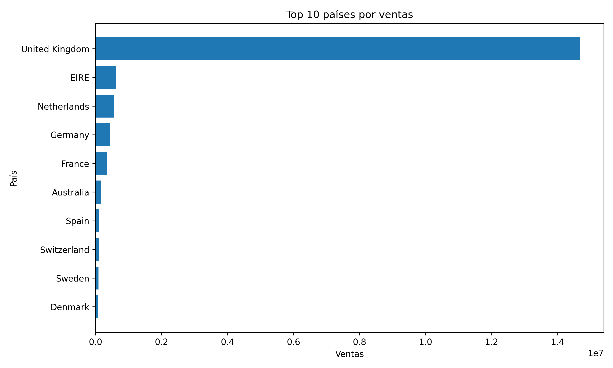


Debido a la fuerte concentración de ventas en United Kingdom, se generó un gráfico adicional excluyendo ese país para observar mejor el comportamiento del resto de mercados.

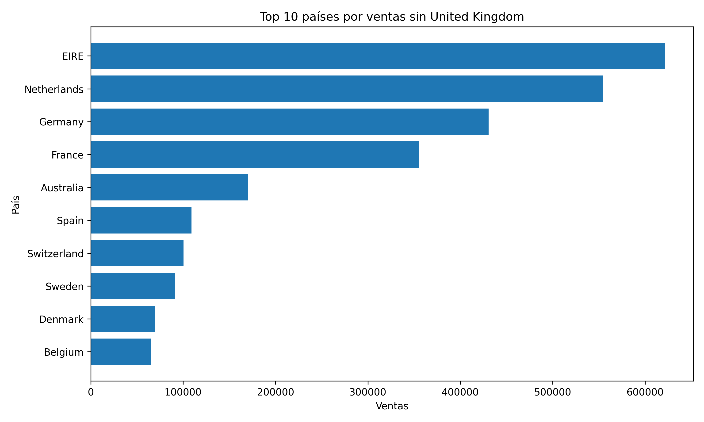


Principales países fuera de United Kingdom:

* EIRE (Irlanda)
* Netherlands
* Germany
* France
* Australia
* Spain
* Switzerland
* Sweden
* Denmark
* Belgium

---

### Evolución mensual de ventas

La evolución mensual muestra una estacionalidad marcada, con aumentos importantes hacia los últimos meses del año.

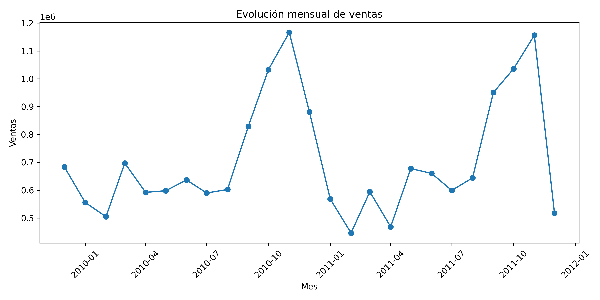

El dataset finaliza el **09/12/2011**, por lo que diciembre de 2011 no representa un mes completo. Por ese motivo, se generó un gráfico adicional excluyendo ese mes incompleto.

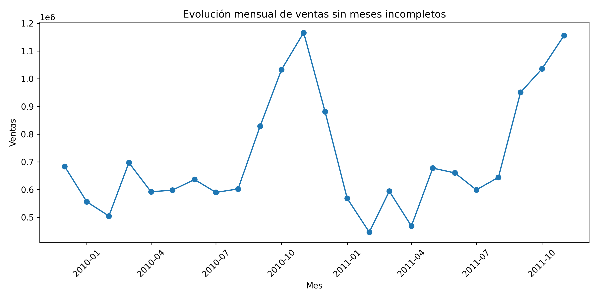


---

### Productos con mayor facturación

Los productos que más facturan no siempre coinciden con los productos más vendidos por cantidad. Esto permite distinguir entre volumen de unidades vendidas y aporte económico real.

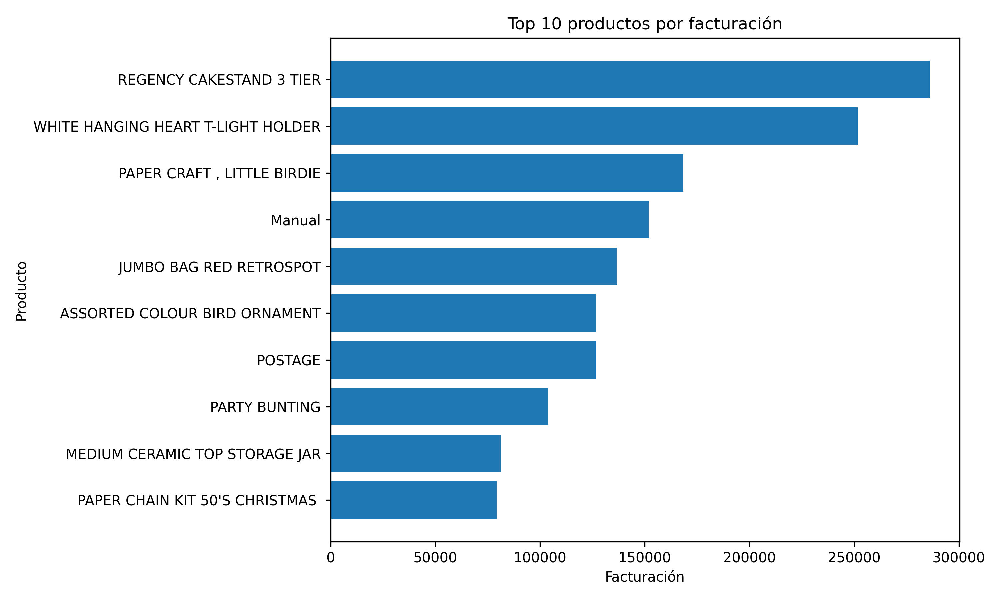


Producto destacado:

```text
REGENCY CAKESTAND 3 TIER
```

---

### Productos con mayor cantidad vendida

Este análisis permite identificar productos de alta rotación.

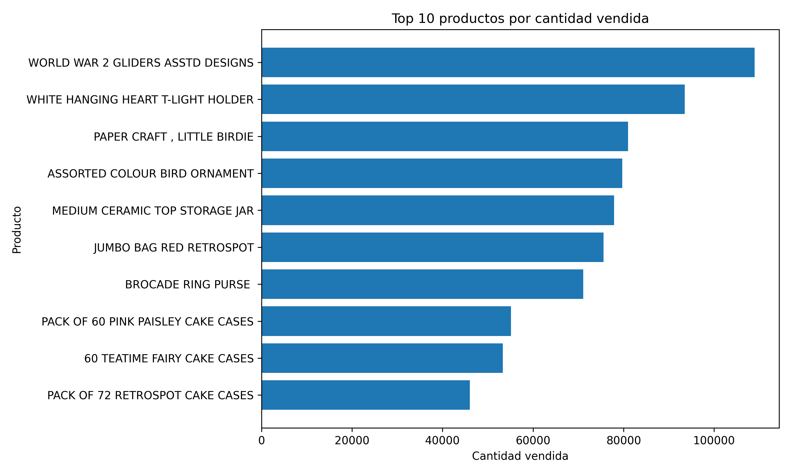

Producto destacado:

```text
WORLD WAR 2 GLIDERS ASSTD DESIGNS
```

---

### Clientes con mayor facturación

Se identificaron clientes con una facturación significativamente superior al promedio, lo cual sugiere una concentración de valor en pocos clientes.

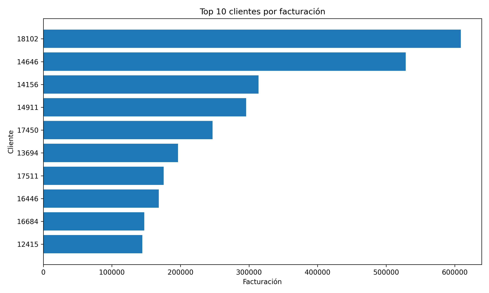

Cliente con mayor facturación:

```text
CustomerID 18102
```

---

## Segmentación de clientes con Spark MLlib

Además del EDA, se implementó una segmentación de clientes utilizando **Spark MLlib**.

El objetivo fue agrupar clientes según su comportamiento de compra a partir de variables RFM:

```text
Recency   = días desde la última compra
Frequency = cantidad de facturas realizadas
Monetary  = facturación total del cliente
```

Se eligió **RFM** porque es una técnica muy usada en retail, e-commerce y CRM para resumir el comportamiento de compra en variables interpretables: recencia, frecuencia y valor monetario.

Luego, estas variables se usaron como entrada para aplicar **KMeans con Spark MLlib** y segmentar clientes.

Módulo utilizado:

```text
ml/customer_segmentation.py
```

---

## Proceso de Machine Learning

El proceso aplicado fue:

```text
Dataset limpio
↓
Agrupación por CustomerID
↓
Cálculo de variables RFM
↓
VectorAssembler
↓
StandardScaler
↓
KMeans con k=4
↓
Asignación de segmento
↓
Interpretación comercial de segmentos
```

Se utilizó `k=4` para obtener cuatro grupos de clientes interpretables desde el punto de vista comercial.

---

## Segmentos obtenidos

Los segmentos identificados fueron:

| Segmento | Nombre                 | Interpretación                                                                                 |
| -------- | ---------------------- | ---------------------------------------------------------------------------------------------- |
| 0        | Base activa            | Clientes medios, con compras relativamente recientes, frecuencia moderada y facturación media. |
| 1        | Ultra VIP              | Muy pocos clientes, con altísima frecuencia y facturación promedio extremadamente alta.        |
| 2        | Inactivos / bajo valor | Clientes con alta recencia, baja frecuencia y bajo gasto promedio.                             |
| 3        | Premium recurrentes    | Clientes con alta frecuencia, buena facturación y compras relativamente recientes.             |

---

## Resumen de segmentos

Resultados generales:

| Segmento                   | Clientes | Recency promedio | Frequency promedio | Monetary promedio |
| -------------------------- | -------: | ---------------: | -----------------: | ----------------: |
| 0 - Base activa            |     3840 |            66,48 |               7,31 |           2997,22 |
| 1 - Ultra VIP              |        4 |             2,75 |             212,50 |         436754,10 |
| 2 - Inactivos / bajo valor |     1999 |           462,49 |               2,21 |            762,79 |
| 3 - Premium recurrentes    |       35 |            25,40 |             103,71 |          82980,34 |

---

## Visualizaciones de segmentación

Cantidad de clientes por segmento:

```markdown
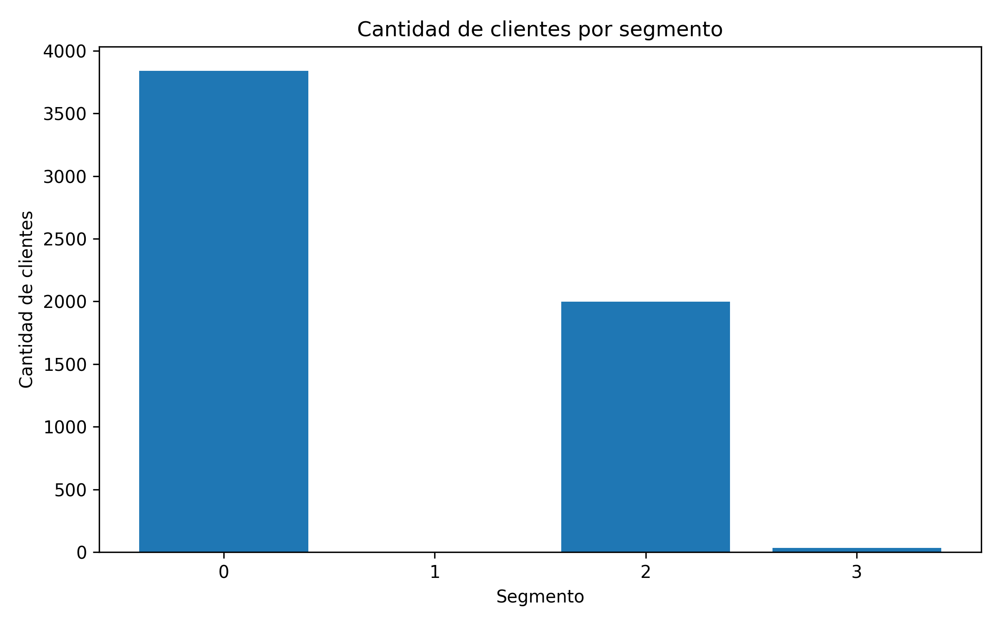
```

Facturación promedio por segmento:

```markdown
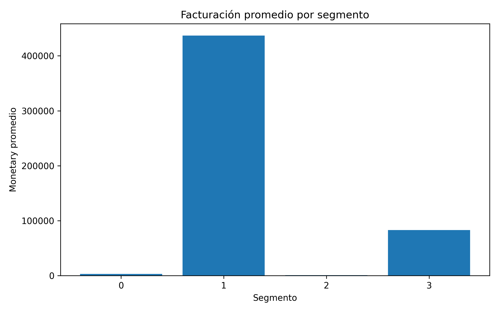
```

Frecuencia promedio por segmento:

```markdown
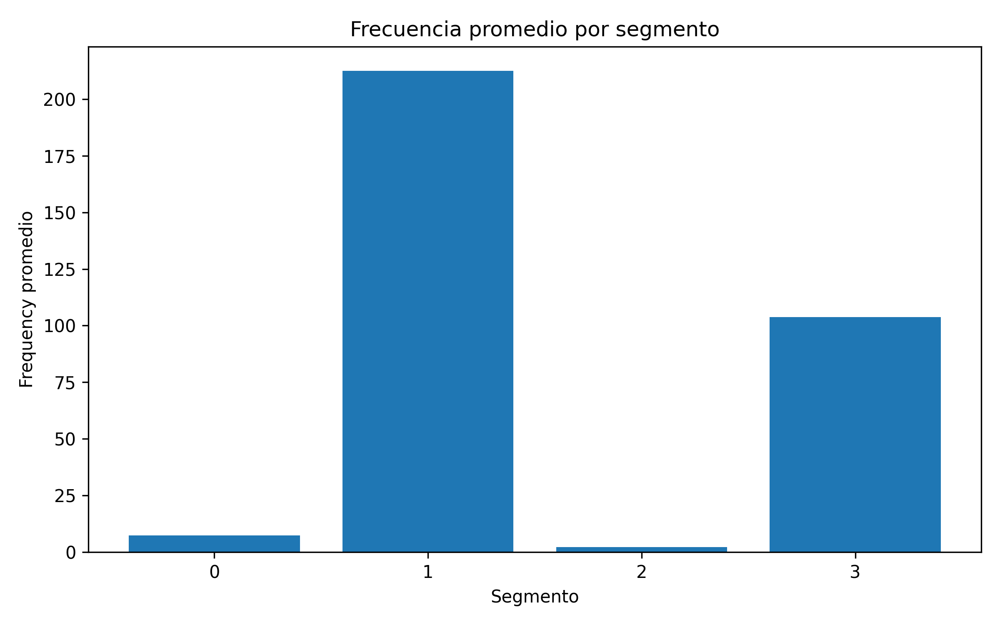
```

Recency promedio por segmento:

```markdown
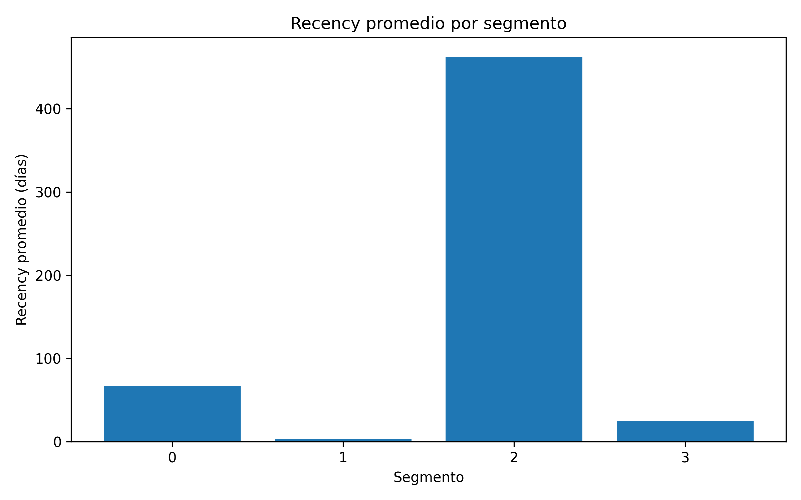
```

---

## Interpretación comercial de la segmentación

El análisis muestra que la mayoría de los clientes se concentra en dos grupos:

* Clientes de valor medio.
* Clientes inactivos o de bajo valor.

Sin embargo, existe un grupo muy pequeño de clientes que concentra un valor económico muy alto. Esto representa una oportunidad comercial importante, ya que permite diseñar estrategias diferenciadas:

* Retención especial para clientes Ultra VIP.
* Beneficios o atención prioritaria para clientes Premium recurrentes.
* Campañas de reactivación para clientes inactivos.
* Estrategias de aumento de ticket para clientes de la base activa.

---

## Exportación de resultados

Las tablas finales se exportan en formato CSV dentro de:

```text
outputs/tables/
```

Tablas generadas:

```text
general_kpis.csv
sales_by_country.csv
monthly_sales.csv
top_products_by_revenue.csv
top_products_by_quantity.csv
top_customers.csv
rfm_customers.csv
segmented_customers.csv
segment_summary.csv
```

El procesamiento principal se realiza con PySpark. Para la exportación final de tablas agregadas pequeñas se utiliza Pandas, con el objetivo de mejorar la portabilidad del proyecto en entorno local Windows y evitar dependencias adicionales de Hadoop/winutils para la escritura de archivos.

---

## Visualizaciones generadas

Los gráficos se guardan en:

```text
outputs/charts/
```

Gráficos generados:

```text
monthly_sales.png
monthly_sales_complete_months.png
sales_by_country.png
sales_by_country_without_uk.png
top_customers.png
top_products_by_quantity.png
top_products_by_revenue.png
segment_customers.png
segment_avg_monetary.png
segment_avg_frequency.png
segment_avg_recency.png
```

---

## Airflow

Se incluye un DAG simple de Apache Airflow como propuesta de orquestación del pipeline.

Archivo:

```text
dags/online_retail_dag.py
```

El DAG contiene dos tareas principales:

```text
1. Ejecutar main.py
2. Ejecutar visualization/generate_charts.py
```

Flujo del DAG:

```text
run_pyspark_pipeline >> generate_charts
```

Esto significa que primero se ejecuta el pipeline principal con PySpark y luego se generan las visualizaciones.

El DAG utiliza una ruta configurable mediante variable de entorno:

```text
ONLINE_RETAIL_PROJECT_PATH
```

También permite configurar el comando de Python mediante:

```text
ONLINE_RETAIL_PYTHON_CMD
```

El pipeline principal fue probado mediante ejecución directa de:

```bash
python main.py
python visualization/generate_charts.py
```

El DAG de Airflow se incluye como capa opcional de orquestación para mostrar cómo podría automatizarse el flujo completo en un entorno productivo.

---

## Consideraciones técnicas

### Uso de PySpark

PySpark fue utilizado como núcleo del procesamiento:

* Carga de datos.
* Limpieza.
* Transformación.
* Agregaciones.
* Cálculo de KPIs.
* Construcción de variables RFM.
* Segmentación con MLlib.

---

### Uso de Pandas

Pandas se utilizó únicamente para:

* Convertir el archivo Excel original a CSV.
* Exportar tablas finales pequeñas ya procesadas.
* Leer resultados agregados para generar gráficos.

El procesamiento analítico principal no se realizó con Pandas.

---

### Uso de Matplotlib

Matplotlib se utilizó para generar visualizaciones a partir de los resultados exportados.

---

### Uso de Spark MLlib

Spark MLlib se utilizó para aplicar KMeans sobre las variables RFM y construir una segmentación escalable de clientes.

---

## Conclusiones

El proyecto permitió construir un pipeline de procesamiento de datos orientado a negocio, utilizando PySpark como motor principal. A partir de datos transaccionales crudos, se generaron métricas comerciales, visualizaciones e información accionable para la toma de decisiones.

Los principales hallazgos fueron:

* United Kingdom concentra la mayor parte de la facturación.
* Existen patrones estacionales con mayor facturación hacia los últimos meses del año.
* Algunos productos concentran alta facturación, mientras otros se destacan por volumen vendido.
* Un grupo reducido de clientes concentra un valor económico muy elevado.
* La segmentación RFM con KMeans permite diferenciar clientes según valor, frecuencia y actividad reciente.

Este tipo de pipeline puede adaptarse a casos reales de análisis comercial en empresas de retail, farmacias, ferreterías, distribuidoras o comercios con datos transaccionales.

---

## Próximos pasos posibles

Algunas mejoras futuras podrían ser:

* Automatizar completamente el pipeline con Airflow en un entorno productivo.
* Persistir datos procesados en una base SQL.
* Construir un dashboard en Power BI o Streamlit.
* Evaluar distintos valores de `k` para KMeans.
* Agregar análisis de cohortes.
* Incorporar predicción de ventas o demanda.
* Analizar márgenes si se cuenta con costos de productos.
* Generar alertas automáticas para cambios bruscos en ventas o clientes inactivos.

---

## Autor

Nombre: Moisés Lobayza
Materia: Procesamiento de Datos
Proyecto: Pipeline escalable de inteligencia comercial para retail con PySpark

```

